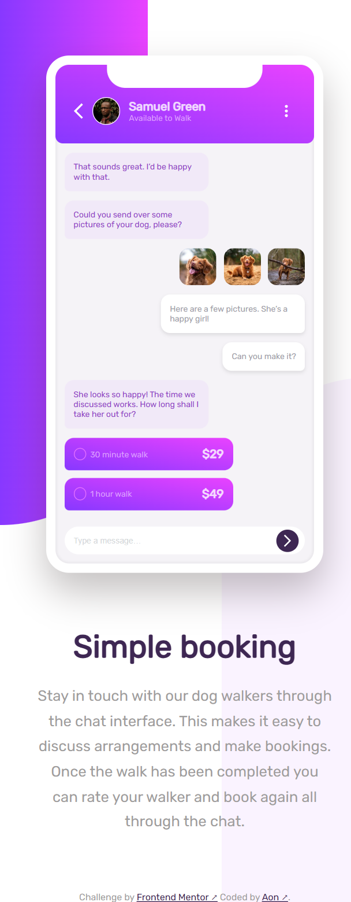
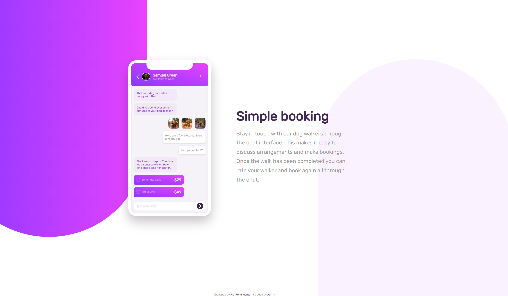

# Frontend Mentor - Chat app CSS illustration solution

This is a solution to the [Chat app CSS illustration challenge on Frontend Mentor](https://www.frontendmentor.io/challenges/chat-app-css-illustration-O5auMkFqY). Frontend Mentor challenges help you improve your coding skills by building realistic projects.

## Table of contents

- [Frontend Mentor - Chat app CSS illustration solution](#frontend-mentor---chat-app-css-illustration-solution)
  - [Table of contents](#table-of-contents)
  - [Overview](#overview)
    - [The challenge](#the-challenge)
    - [Screenshot](#screenshot)
    - [Links](#links)
  - [My process](#my-process)
    - [Built with](#built-with)
  - [Author](#author)

**Note: Delete this note and update the table of contents based on what sections you keep.**

## Overview

### The challenge

Users should be able to:

- View the optimal layout for the component depending on their device's screen size
- **Bonus**: See the chat interface animate on the initial load

### Screenshot

  <figure style="margin: 0; height: 100%; text-align: center;">
    <figcaption>Mobile preview</figcaption>
    

  </figure>
  <figure style="margin: 0; width: 80%; text-align: center;">
    <figcaption>Desktop preview</figcaption>
    
  </figure>

### Links

- [Solution URL](https://www.frontendmentor.io/solutions/clipboard-landing-page-using-flexbox-HYkimJV2Vj)
- [Live Site URL](https://aon-m.github.io/chat-app-css-illustration-master/)

## My process

### Built with

- Semantic HTML5 markup
- CSS custom properties
- Flexbox
- CSS Grid
- Mobile-first workflow
- Google Fonts

## Author

- Frontend Mentor - [@Aon](https://www.frontendmentor.io/profile/Aon-m)
- CSSBattle - [@Aon](https://cssbattle.dev/player/aon)
